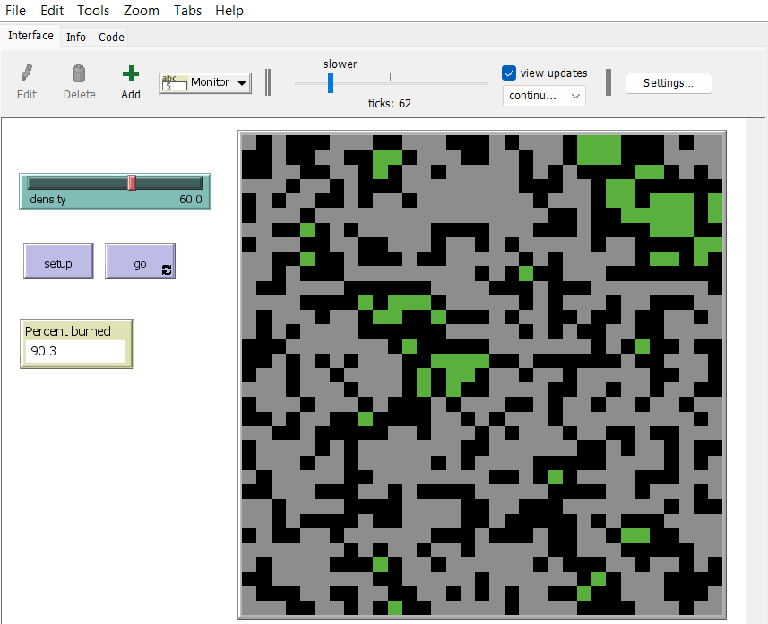
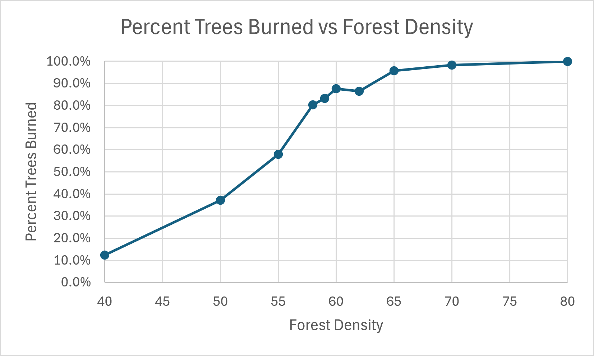

```netlogo

```


**Percent Burned at end of run:** 90.3%

**Part B1: Markdown Table of Results:**
| Density | Run 1  | Run 2 | Run 3  | Run 4 | Run 5  | Run 6  | Run 7 | Run 8 | Run 9  | Run 10 | Average |
| ------- | ------ | ----- | ------ | ----- | ------ | ------ | ----- | ----- | ------ | ------ | ------- |
| 40      | 8.4%   | 10.4% | 7.2%   | 12.8% | 7.5%   | 16.0%  | 17.3% | 19.4% | 16.0%  | 8.8%   | 12.4%   |
| 50      | 20.1%  | 45.4% | 39.7%  | 13.3% | 33.1%  | 60.2%  | 43.9% | 40.8% | 50.6%  | 24.3%  | 37.1%   |
| 55      | 76.0%  | 88.7% | 75.2%  | 75.6% | 48.9%  | 61.9%  | 21.7% | 40.1% | 31.2%  | 60.2%  | 58.0%   |
| 58      | 85.9%  | 86.2% | 64.2%  | 94.8% | 68.1%  | 85.8%  | 74.0% | 66.0% | 91.4%  | 85.9%  | 80.2%   |
| 59      | 72.1%  | 93.4% | 91.6%  | 84.2% | 74.3%  | 93.3%  | 94.1% | 58.3% | 86.4%  | 83.8%  | 83.2%   |
| 60      | 85.8%  | 89.7% | 93.1%  | 89.1% | 92.7%  | 94.9%  | 88.4% | 91.2% | 79.0%  | 72.2%  | 87.6%   |
| 62      | 89.2%  | 84.1% | 84.9%  | 84.5% | 79.5%  | 94.6%  | 96.7% | 74.2% | 84.9%  | 92.0%  | 86.5%   |
| 65      | 96.7%  | 96.1% | 90.6%  | 91.3% | 96.5%  | 96.5%  | 97.8% | 95.0% | 99.1%  | 97.5%  | 95.7%   |
| 70      | 98.6%  | 97.4% | 97.9%  | 99.6% | 96.7%  | 98.0%  | 98.4% | 98.9% | 99.1%  | 98.3%  | 98.3%   |
| 80      | 100.0% | 99.8% | 100.0% | 99.8% | 100.0% | 100.0% | 99.9% | 99.9% | 100.0% | 99.5%  | 99.9%   |

**Part B2: Plot of mean burned vs density**


**Part B3: Critical Density** 

The percent jumps from "small" at 55% density to "large" at 58% density - meaning the critical density is around 58%.

**Part B4: Critical Density vs 40% and 80%**

Variability is lower near the lowest and highest densities - at low densities, the chance of a tree existing in one of the 4 neighbouring spots is always low, almost always causing the fire to fizzle out - at high densities, the chance of there being any isolated trees at all, conversley, is low. At the threshold, the trees near the starting locations of the fire will randomly either have really strong pathways or very weak ones which are purely dependent on the random setup of the forest, while low and high density will have almost none or total pathways respectively.


